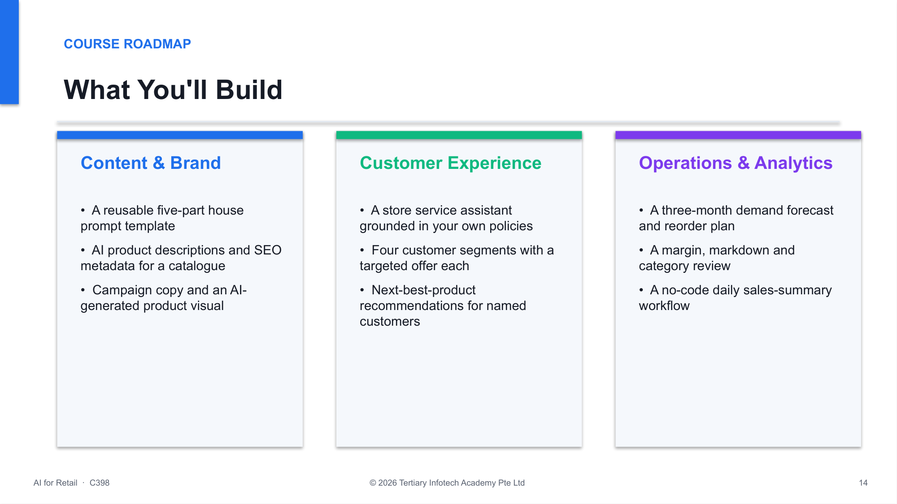

<div align="center">

# AI for Retail

[](https://www.tertiarycourses.com.sg/ai-for-retail.html)
[](#lesson-plan)
[](#getting-started)
[](https://chatgpt.com)
[](https://claude.ai)
[](#license)

**Nine hands-on labs that put generative AI to work across a retail business — product copy, campaign visuals, a grounded service assistant, personalised offers, demand forecasting, pricing analytics and a no-code daily workflow. No programming required.**

[📘 Course Page](https://www.tertiarycourses.com.sg/ai-for-retail.html) · [📖 Learner Guide](LG-AI%20for%20Retail.md) · [🧪 Labs](labs/) · [🐛 Report Bug](https://github.com/tertiarycourses/C398-AI-for-Retail/issues) · [💡 Request Feature](https://github.com/tertiarycourses/C398-AI-for-Retail/issues)



</div>

> [!NOTE]
> **These are the official hands-on lab materials for the course:**
> ### 🛍️ AI for Retail
> **Course Code:** `C398` · by Tertiary Courses / Tertiary Infotech
> **Course page:** https://www.tertiarycourses.com.sg/ai-for-retail.html

---

## Lab Activities

All nine labs run on **one connected scenario** — *Bloom & Brew*, a fictional specialty home, gift and coffee retailer with six outlets and an online store. The synthetic data in [`labs/resources/`](labs/resources/) carries through the whole day, so every lab builds on the one before it.

**Lab 1 — [Brief an AI Assistant Like a Retail Manager](labs/lab01-brief-ai-assistant-retail/README.md)** · One retail brief across ChatGPT, Claude and Copilot/Gemini. Build the five-part prompt pattern — role, context, task, format, constraints — and score the three assistants against each other.

**Lab 2 — [Generate a Product Catalogue with AI](labs/lab02-generate-product-catalogue-ai/README.md)** · Ground the assistant in the catalogue and brand voice guide, then produce descriptions, feature bullets and SEO metadata for five SKUs in one pass — and fact-check every claim back to the source file.

**Lab 3 — [Campaign Copy and AI Product Visuals](labs/lab03-campaign-copy-ai-product/README.md)** · A full seasonal campaign kit: email subject lines and body, three social captions, a poster headline, plus an AI-generated product visual iterated one variable at a time.

**Lab 4 — [Customer Data Privacy and Responsible AI](labs/lab04-customer-data-privacy-responsible/README.md)** · Classify the columns, build an anonymised extract that is safe to paste into a public AI tool, draft the store's AI usage policy — then red-team it to find what it fails to cover.

**Lab 5 — [Build a Grounded Store Service Assistant](labs/lab05-build-grounded-store-service/README.md)** · A Project or Custom GPT grounded in your own policies, FAQ and product data, with tone and escalation rules, tested against real enquiries — including one the policy deliberately does not cover.

**Lab 6 — [Personalised Recommendations and Targeted Promotions](labs/lab06-personalised-recommendations-targeted-promotions/README.md)** · Segment customers by recency, frequency and value, design a targeted offer per segment, then build next-best-product recommendations for three named customers — and check the margin.

**Lab 7 — [Demand Forecasting and Inventory Planning with AI](labs/lab07-demand-forecasting-inventory-planning/README.md)** · Two years of sales history into trend, seasonality, a three-month forecast, reorder points with safety stock and a slow-mover list — with one reorder point recomputed by hand.

**Lab 8 — [AI for Pricing, Merchandising and Sales Analytics](labs/lab08-ai-pricing-merchandising-sales/README.md)** · Margin by SKU and category, markdown and price-increase candidates, a modelled 15% markdown with its break-even uplift, and a one-page KPI summary with three actions.

**Lab 9 — [Build a Simple AI Workflow for a Daily Retail Task](labs/lab09-build-simple-ai-workflow/README.md)** · Trigger → data → AI step → output → human check. A no-code daily sales summary with drafted review replies, documented as an SOP and proven to repeat on a second day of data.

---

## About

This repository contains the complete lab materials for the **AI for Retail** short course (**C398**) by Tertiary Courses / Tertiary Infotech. It is a **one-day, no-code course**: everything is done in a browser with an AI assistant and a spreadsheet — no programming, no installation.

Every lab produces an artifact a retailer could use the next morning, and every lab ends with a **Test it** verification the learner runs themselves. There is no assessment — those verification steps are the feedback.

### What you'll learn

| # | Lab | Concepts |
|---|-----|----------|
| **1** | **Brief an AI Assistant** | The five-part prompt pattern; comparing ChatGPT, Claude, Copilot and Gemini on one task |
| **2** | **Product Catalogue with AI** | Grounding on your own data, batch generation, SEO metadata, fact-checking AI claims |
| **3** | **Campaign Copy & Visuals** | Multi-asset campaign briefs, image prompting, one-variable iteration, pre-publication checks |
| **4** | **Privacy & Responsible AI** | Column classification, anonymisation, an AI usage policy, red-teaming, human in the loop |
| **5** | **Grounded Service Assistant** | Projects and Custom GPTs, knowledge grounding, tone rules, escalation instead of invention |
| **6** | **Personalisation** | Recency-frequency-value segmentation, targeted offers, next-best-product, margin checks |
| **7** | **Demand Forecasting** | Trend and seasonality, three-month forecasts, reorder point, safety stock, slow movers |
| **8** | **Pricing & Analytics** | Gross margin, markdown candidates, break-even uplift, category review, KPI summary |
| **9** | **No-Code AI Workflow** | Trigger, data, AI step, output, human check; SOP documentation; repeatability |

> 📖 **Full walkthrough:** see **[LG-AI for Retail.md](LG-AI%20for%20Retail.md)** for detailed, step-by-step instructions for every lab. The slide deck, Learner Guide and Lesson Plan are in [courseware/](courseware/).

---

## Tech Stack

| Category | Tool |
|----------|------|
| **AI Assistants** | [ChatGPT](https://chatgpt.com), [Claude](https://claude.ai), [Microsoft Copilot](https://copilot.microsoft.com), [Google Gemini](https://gemini.google.com) |
| **Grounded Assistants** | ChatGPT Projects / Custom GPTs, Claude Projects |
| **Image Generation** | ChatGPT image generation, Gemini, Copilot Designer |
| **Spreadsheet** | Google Sheets or Microsoft Excel |
| **Sample Data** | Synthetic CSV and Markdown, generated by [tools/make_sample_data.py](tools/make_sample_data.py) |
| **Courseware** | Slides (`python-pptx`), Learner Guide and Lesson Plan (`python-docx`) |

---

## Lesson Plan

One day, **7.5 instructional hours** (9:30am–6:30pm, 1-hour lunch, tea breaks within training time).

```
TOPIC 1 — Introduction to AI for Retail                        (Labs 1-4 · 135 min)
  Lab 1  Brief an AI assistant       ChatGPT / Claude / Copilot -> 5-part prompt
  Lab 2  Product catalogue           products.csv + brand_voice.md -> web copy
  Lab 3  Campaign copy & visuals     email + social + poster + AI product image
  Lab 4  Privacy & responsible AI    classify -> anonymise -> policy -> red-team

TOPIC 2 — Applying AI to Operations and Customer Experience     (Labs 5-9 · 195 min)
  Lab 5  Grounded service assistant  policies + FAQ + products -> Project / GPT
  Lab 6  Personalisation             transactions -> RFM segments -> offers
  Lab 7  Demand forecasting          24 months history -> forecast -> reorder plan
  Lab 8  Pricing & analytics         margin -> markdown model -> KPI summary
  Lab 9  No-code AI workflow         trigger -> data -> AI -> output -> human check
```

---

## Project Structure

```
C398-AI-for-Retail/
├── LG-AI for Retail.md                 # Full step-by-step Learner Guide (start here)
├── README.md
├── screenshot.png
│
├── labs/                               # All nine hands-on labs (one folder each)
│   ├── README.md                       # Lab index + data-file guide
│   ├── lab01-brief-ai-assistant-retail/
│   ├── lab02-generate-product-catalogue-ai/
│   ├── lab03-campaign-copy-ai-product/
│   ├── lab04-customer-data-privacy-responsible/
│   ├── lab05-build-grounded-store-service/
│   ├── lab06-personalised-recommendations-targeted-promotions/
│   ├── lab07-demand-forecasting-inventory-planning/
│   ├── lab08-ai-pricing-merchandising-sales/
│   ├── lab09-build-simple-ai-workflow/
│   └── resources/                      # Synthetic Bloom & Brew data
│       ├── products.csv                # 24 SKUs with cost, retail, stock, materials
│       ├── customers.csv               # 60 customers (with PII - Lab 4 strips it)
│       ├── transactions.csv            # 591 order lines, last 6 months
│       ├── sales_history_monthly.csv   # 24 months of units by SKU
│       ├── customer_feedback.csv       # 30 enquiries, reviews and complaints
│       ├── store_policies.md           # Returns, delivery, loyalty, care, privacy
│       ├── faq.md                      # 20 customer FAQs
│       └── brand_voice.md              # Tone of voice rules
│
├── courseware/                         # Slide deck, Lesson Plan and Learner Guide
│   ├── AI for Retail-v1.0.pptx         # 101-slide deck (+ PDF)
│   ├── LP-AI for Retail.docx           # 1-day lesson plan (+ PDF)
│   └── LG-AI for Retail.docx           # Detailed learner guide (+ PDF)
│
└── tools/
    ├── make_sample_data.py             # Regenerates the synthetic dataset (fixed seed)
    ├── build_labs.py                   # Regenerates the lab READMEs from the course source
    └── audit_alignment.py              # Verifies PPT / LP / LG / labs stay 100% aligned
```

---

## Getting Started

### Prerequisites

- A laptop with a modern browser and a stable internet connection
- A free [**ChatGPT**](https://chatgpt.com) account — the assistant used in most labs
- A free [**Claude**](https://claude.ai) account, plus [**Microsoft Copilot**](https://copilot.microsoft.com) or [**Google Gemini**](https://gemini.google.com) for the comparison lab
- A **Google account** for Google Sheets (Labs 6-9), or Excel
- **No programming experience and no software installation required**

### 1. Clone the repo

```bash
git clone https://github.com/tertiarycourses/C398-AI-for-Retail.git
cd C398-AI-for-Retail
```

### 2. Open the data

Everything the labs need is in [labs/resources/](labs/resources/). Open `products.csv` in a
spreadsheet to check it loaded correctly, then start at
[Lab 1](labs/lab01-brief-ai-assistant-retail/README.md).

### 3. Work through the labs in order

Each lab README carries the same structure: **Goal**, **What you'll build**, **Prerequisites**,
numbered **Steps** with the exact prompt to paste, **Test it**, **Troubleshooting**, a
**Challenge** and a **Reflection** question. If you fall behind, every lab states the file it
starts from, so you can rejoin at any lab.

> ⚠️ **Data safety:** every file in this repository is **synthetic** — generated with a fixed
> seed by [tools/make_sample_data.py](tools/make_sample_data.py). There is no real customer,
> payment or employee data anywhere in this repository. Never paste real customer data into a
> public AI tool; Lab 4 exists to show you how to avoid it.

### Rebuilding the materials

```bash
python tools/make_sample_data.py        # regenerate the synthetic dataset
python tools/build_labs.py              # regenerate the lab READMEs
python tools/audit_alignment.py         # verify PPT / LP / LG / labs are aligned
```

The slide deck, Lesson Plan and Learner Guide are all generated from one source
(`course_data.py` plus `data_domainN.py`), so they cannot drift apart.

---

## Contributing

Contributions, fixes, and improvements are welcome:

1. **Fork** the repository
2. Create a feature branch: `git checkout -b feature/my-improvement`
3. Commit your changes: `git commit -m "Add my improvement"`
4. Push the branch: `git push origin feature/my-improvement`
5. Open a **Pull Request**

Found a bug or have an idea? Open an [issue](https://github.com/tertiarycourses/C398-AI-for-Retail/issues).

---

## License

This material is provided for **educational use** as part of the course **C398 — AI for Retail**.
© 2026 Tertiary Infotech Pte. Ltd. All rights reserved.

---

## Developed By

**Tertiary Infotech Pte. Ltd.** — [Tertiary Courses](https://www.tertiarycourses.com.sg)
Course: [AI for Retail (C398)](https://www.tertiarycourses.com.sg/ai-for-retail.html)

## Acknowledgements

- [OpenAI](https://openai.com), [Anthropic](https://www.anthropic.com), [Microsoft](https://copilot.microsoft.com) and [Google](https://gemini.google.com) — the AI assistants used in the labs
- Course trainers and learners of C398

---

<div align="center">

⭐ **If this helped you put AI to work in your store, star the repo!**

Powered by [Tertiary Infotech Academy Pte Ltd](https://www.tertiaryinfotech.com/)

[📘 Course Page](https://www.tertiarycourses.com.sg/ai-for-retail.html) · [📖 Learner Guide](LG-AI%20for%20Retail.md)

</div>
